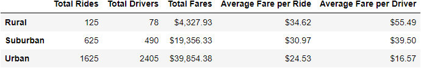
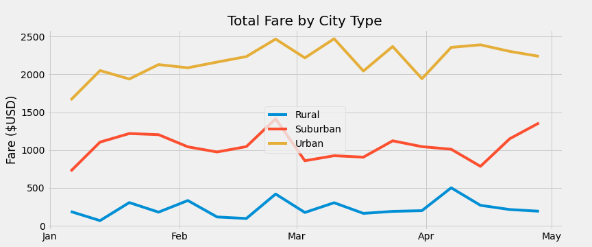

# RBCModule5-Pyber

## Overview of the Analysis
The purpose of this analysis is to further exemplify the usage of matplotlib and pandas packages by graphing comparative data regarding ride-sharing programs in different cities. 
## Results
Here we present the computed results from this analysis. 

The chart above shows several notable qualities. First, as expected, the Total Number of Rides and Total Drivers diminish as Distance Between Destinations (Urban -> Suburban -> Rural) increases. Likewise, Average Fares per Ride and Average Fares per Driver increase due to these increased ride times. This data is very rational. 

## Summary
In addressing this data, for any business venture in this space, one must see that despite the high statistic of Average Fare per Driver in the Rural regions, as per the graph Total Fare by City Type, above, the Urban ride-share programs are much more profitable and are the bulk of the business. Further, it appears to be hard to hire drivers in the Rural regions, vs Urban regions. Finally, it appears we have a greater number of Urban Drivers than are giving rides which is bad from a microeconomics perspective of excess supply. 